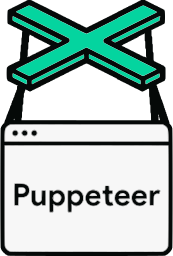

# Hi 👋, I'm Samuel

A passionate full stack developer from Brazil

- 💬 Ask me about **React, Node.js, JavaScript**

- 📫 How to reach me **samuel.novaes.96@gmail.com**

- 📄 Know about my experiences [https://www.linkedin.com/in/samuelnovaes](https://www.linkedin.com/in/samuelnovaes)

- ⚡ Fun fact **My first programming language was PHP**

## Connect with me:

## Languages and Tools:

## Github Stats

